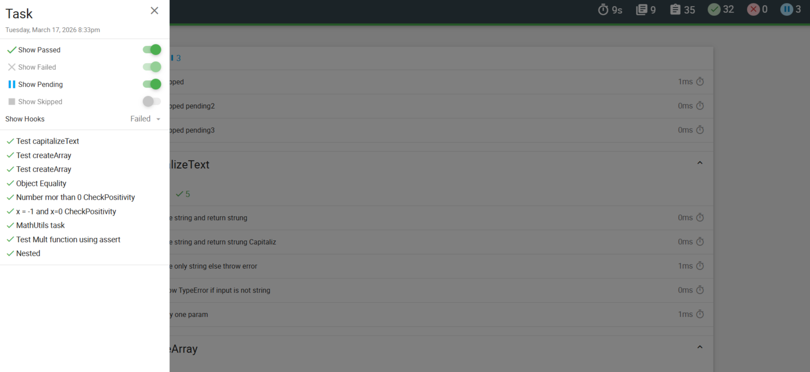
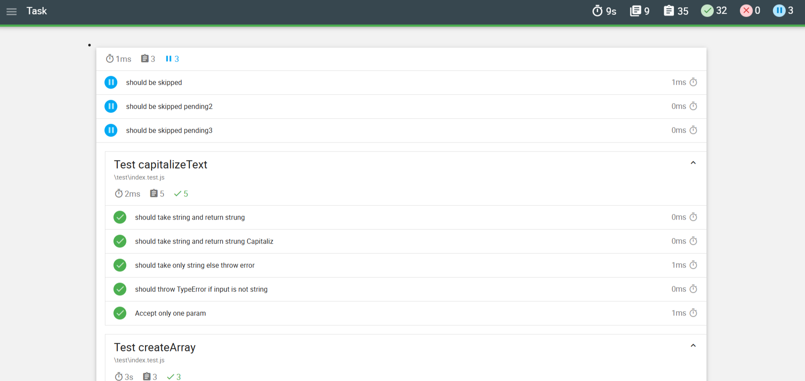
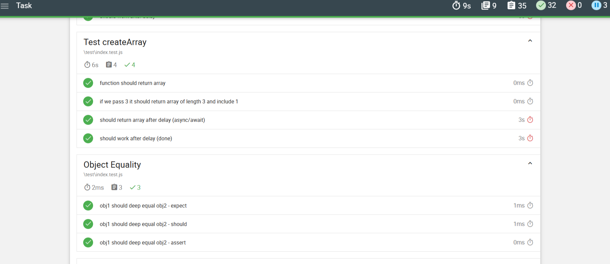
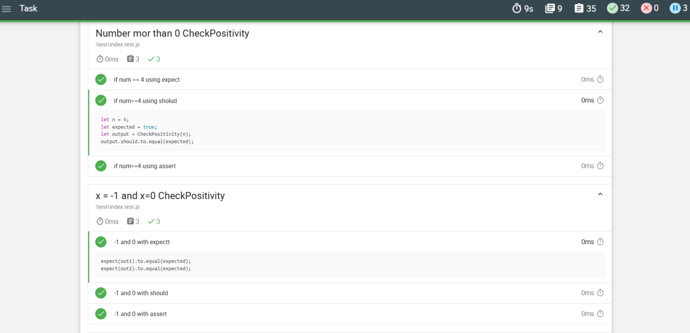
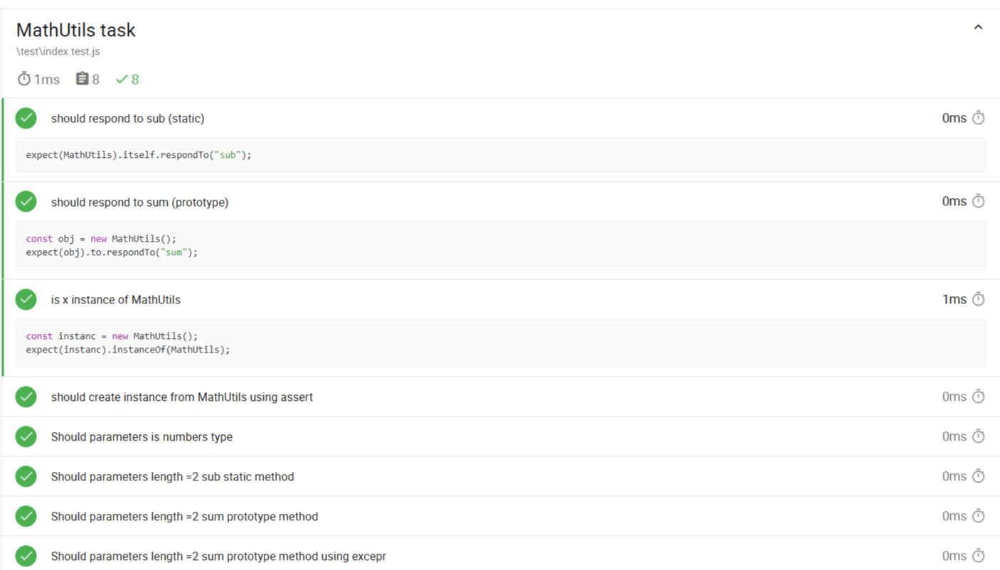

# 🧪 JavaScript Testing Project (Mocha + Chai + Mochawesome)

[](https://nodejs.org/)
[](https://mochajs.org/)
[](https://www.chaijs.com/)
[](https://github.com/adamgruber/mochawesome)

---
## 🖼️ Project Screens

###  Mochawesome HTML Report

---

---

---

---

---

---


---

## 📌 Project Overview

This project demonstrates **Unit Testing in JavaScript** using:

- **Mocha** as the testing framework
- **Chai** for assertions
- **Mochawesome** for generating professional HTML reports with charts

The project focuses on:
- Function validation
- Error handling
- Input validation
- Test automation
- Report generation

---

##  Learning Objectives

By completing this project, the following concepts were applied:

###  Testing Fundamentals
- Writing test suites using `describe()`
- Writing test cases using `it()`


### 🔹 Assertions with Chai
- `expect`
- `assert`
- `should`
- Error testing using `.to.throw()`
- Checking values with `.to.equal()`
- Testing objects with `.include()`
- Deep equality vs shallow equality

###  Advanced Concepts
- Exception handling
- Testing nested objects
- Testing function parameters
- Generating HTML reports
- Using npm scripts
- Managing dependencies

---

## 🛠 Technologies Used

- Node.js
- Mocha
- Chai
- Mochawesome
- Git & GitHub

---

## 🚀 Installation & Setup

### 1- Prerequisites

Make sure you have the following installed:

- **Node.js** (v16 or higher) → https://nodejs.org/
- **npm** (comes with Node.js)

--**1-Check installation:**

```bash
node -v
npm -v
```
--**2-Clone the Repository:**
```bash
git clone <your-repo-link>
cd Task
```


--**3-Install Dependencies:**
```bash
npm install
```
--**4-Run Tests**
```bash
npm test
```

--**5-Generate HTML Report (if using mochawesome):**
Add this script in package.json:
```bash
"scripts": {
  "test": "mocha",
  "report": "mocha test --reporter mochawesome --reporter-options reportDir=reports,reportFilename=TestReport,overwrite=true,html=true,json=true"
}
```

--**6-Then run:**
```bash
npm run report
```

The report will be generated inside:

/reports/TestReport.html

**Open it in your browser to view the results.**
---
## 👨‍💻 Author

**Abanoub Maqqar**

🔗 **GitHub:** https://github.com/Abanoubmaqqar19

🔗 **LinkedIn:** [abanoub](https://www.linkedin.com/in/abanoub-maqqar/)  

 **Role:** Full Stack  Developer  (MEARN)  

 **Focus:** JavaScript Testing, Automation, and Clean Code  

 **Purpose:** Learning Unit Testing & Professional Reporting
